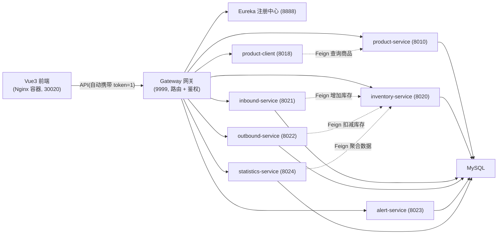

# WIMS 仓库库存管理系统

[](https://spring.io/projects/spring-cloud)
[](https://kubernetes.io/)
[](https://vuejs.org/)
[](https://www.jenkins.io/)

基于 Spring Cloud 微服务架构的仓库库存管理系统(WIMS):商品档案、库存台账、入库/出库单、库存预警、统计日报五大业务,配套 Vue3 单页前端。全服务容器化,支持 Kubernetes 集群部署与 Jenkins 流水线一键交付。

## 功能特性

- **商品管理**:商品档案 CRUD,支持按 ID 单条查询
- **库存台账**:查询/增加/扣减;扣减带防超卖约束,低于安全库存自动标记
- **入库 / 出库单**:单据管理,经 Feign 服务间调用联动库存增加/扣减
- **库存预警**:比对安全库存生成 LOW 告警,自动去重,支持手动检查与处理
- **统计日报**:Feign 聚合入库、出库与库存数据,生成每日汇总
- **微服务治理**:Eureka 注册发现、网关统一鉴权与路由、负载均衡、Hystrix 熔断降级
- **一站式交付**:Git 触发 Jenkins,完成编译 → 镜像构建 → 推送 → Kubernetes 滚动部署

## 技术栈

| 层 | 技术 |
| --- | --- |
| 后端 | Spring Boot 2.0.9 / Spring Cloud Finchley.SR2 / JDK 8 / MyBatis / MySQL 8 / Undertow |
| 前端 | Vite 5 / Vue 3.5 / Vue Router 4 / Element Plus 2.9 / Axios |
| 基础设施 | Kubernetes 1.28(1 master + 2 worker)/ containerd / nerdctl / Nginx |
| 交付 | Jenkins(声明式流水线,六阶段)/ GitHub SSH 凭据 / 阿里云容器镜像仓库 |

## 系统架构



`deploy-k8s/` 中各服务均为独立镜像,以 Deployment + Service(NodePort)形式部署于 `stockmgr` 命名空间;前端 Nginx 容器将 API 路径反代至集群内网关,页面与接口同源无跨域。

## 目录结构

```text
wims
├── eureka-service/          服务注册中心
├── gateway-service/         API 网关(路由 + token 鉴权)
├── product-service/         商品服务
├── product-client/          Feign 客户端(负载均衡/熔断)
├── inventory-service/       库存服务
├── inbound-service/         入库服务
├── outbound-service/        出库服务
├── alert-service/           预警服务
├── statistics-service/      统计服务
├── wims-web/                前端工程(Vite + Vue3)
├── deploy-k8s/              Kubernetes 部署清单
├── sql/                     数据库初始化脚本
└── Jenkinsfile              GitOps 流水线定义
```

## 快速开始(本地)

**依赖**:JDK 8、Maven 3.x、MySQL 8.0(默认 root/root@127.0.0.1:3306)

```bash
# 1. 初始化数据库(幂等,可重复执行)
mysql -uroot -proot < sql/wims.sql

# 2. 按序启动服务(依次打开单独终端)
mvn -pl eureka-service    spring-boot:run
mvn -pl product-service   spring-boot:run
mvn -pl product-client    spring-boot:run
mvn -pl inventory-service spring-boot:run
mvn -pl inbound-service   spring-boot:run
mvn -pl outbound-service  spring-boot:run
mvn -pl alert-service     spring-boot:run
mvn -pl statistics-service spring-boot:run
mvn -pl gateway-service   spring-boot:run

# 3. 启前端(开发模式,代理指向网格网关)
cd wims-web && npm install && npm run dev
```

除产品档案、库存台账等基础接口外,列表查询也提供服务接口,便于直接联调:

```bash
curl "http://localhost:9999/product/queryAllProduct?token=1"    # 网关鉴权 token=1
curl "http://localhost:8020/stock/list"                          # 库存台账
```

## 部署(Kubernetes)

**前置**:镜像需推送到你自建的私有容器镜像仓库(本项目使用阿里云个人版 `cr.aliyuncs.com` 的 `my-wims` 命名空间),集群内已创建命名空间 `stockmgr` 与拉取凭据 secret `aliyun-registry`。

```bash
# 手动方式:构建并推送全部镜像后,替换版本号再应用清单
bash build-wims.sh
sed -i 's|:v1\.1|:你的版本号|g' deploy-k8s/*.yaml
kubectl apply -f deploy-k8s/ -n stockmgr
```

**推荐方式(GitOps)**:`git push origin master` 触发 Jenkins 流水线自动完成:

| 阶段 | 动作 |
| --- | --- |
| Checkout | 拉取最新代码 |
| Build | `mvn clean package -Dp.env=k8s` 打包 10 个模块 |
| BuildImages / BuildWeb | 构建 9 个微服务镜像 + 前端镜像(tag = BUILD_NUMBER) |
| Pushimage | 推送全部镜像至阿里云私仓 |
| Deploy | 替换 yaml 版本号 → `kubectl apply` → 动态获取 Deployment 列表逐个等待滚动完成 |

**访问入口**:前端 `http://<master>:30020`、网关 `http://<master>:30099`、Eureka `http://<master>:30001`。

## License

本项目基于课程学习需求开发,仅供学习交流使用。
